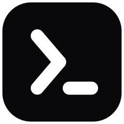

<div align="center">



# Profile Auto Launcher

**One window opens your whole working context** — the apps, the tabs, the
containers, the terminals. Pick *Dev*, *Work* or *Gaming*; `palaunch stop`
closes it all again.

Windows · Linux · macOS · Python 3.10+ · MIT

</div>

---

## Install

| You are on | Do this |
|---|---|
| **Windows** | Run `palaunch-setup-<version>.exe` from the [latest release](https://github.com/MuszKarol/profile-auto-launcher/releases). Per-user, no administrator prompt. |
| **Anything else** | `pip install "profile-auto-launcher[full]"` then `palaunch install` |
| **No Python at all** | Unpack the self-contained binary from a [release](https://github.com/MuszKarol/profile-auto-launcher/releases) and run `./palaunch install` |

`palaunch install` copies the sample profiles, writes the editor schema, adds a
menu entry and registers the login item. Add `--cli` to skip the window,
`--uninstall` to undo it. Your profiles are never touched either way.

> Debian/Ubuntu need `sudo apt install python3-tk` for the windows. Without it
> the command line still does everything.

---

## Quick start

### 1. Make a profile

```bash
palaunch new "My Setup" --gui                 # wizard — lists what you have installed
palaunch new "My Setup" --app code --url http://localhost:3000
palaunch record "My Setup" --duration 120     # just work; it watches and writes the YAML
```

Or write the file yourself:

```yaml
name: Dev
description: Spin up the full dev environment
hotkey: <ctrl>+<alt>+d

steps:
  - type: app
    name: VS Code
    path:
      windows: "%LOCALAPPDATA%\\Programs\\Microsoft VS Code\\Code.exe"
      linux: /usr/bin/code
    window: {monitor: 1, position: left-half}

  - type: command
    name: docker
    run: ["docker", "compose", "up", "-d"]

  - type: wait_for            # don't open the tab before the server answers
    url: http://localhost:8080

  - type: url
    url: http://localhost:8080

  - type: rsync               # mirror today's notes to the NAS
    src: ~/notes
    dest: nas:/volume1/notes
    delete: true

teardown:                     # what `palaunch stop Dev` does
  - type: command
    run: ["docker", "compose", "down"]
```

### 2. Check it, then run it

```bash
palaunch run "My Setup" --dry-run    # describes every step, executes nothing
palaunch run "My Setup"
palaunch stop "My Setup"             # teardown, then close what it opened
```

### 3. Make it resident

```bash
palaunch tray
```

`Alt+Space` opens the launcher from anywhere. The tray also fires per-profile
`hotkey:` bindings and scheduled profiles, and setup registers it to start at
login.

---

## The two windows

### The launcher — `Alt+Space`, or `palaunch pick`

- Type to filter, `↑↓` to move, `→` to preview the steps, `Enter` to run.
- Searches **profiles and installed applications together**: type `firef`,
  press Enter, and only Firefox opens — no profile needed.
- Everything it starts is tracked, so `palaunch status` sees it and
  `palaunch stop "Quick launch"` closes it.
- Monochrome on purpose — one accent, no colour coding, no emoji. Hierarchy
  comes from weight and space, which is what keeps a dense window readable.

### The manager — `palaunch settings`, `Ctrl+,`, or the tray

| Page | What it does | CLI equivalent |
|------|--------------|----------------|
| Launch   | Run a profile, or one app by name; stop what is running | `run` / `app` / `stop` |
| Profiles | Create, edit, record, validate, switch | `new` / `edit` / `record` |
| Sync     | Git repo **and** rsync mirror of the profiles directory | `sync [--mirror]` |
| Activity | Past runs, per-step timings and failure rates, the log | `history` / `logs` |
| Settings | Every option, the credential store, the paths, setup | `config set` / `secret` / `where` |

---

## How it works

- **Profiles are YAML files** in your config directory — `palaunch where`
  prints the exact path.
- **Steps form a graph, not a script.** A step waits for the ones before it,
  adjacent `parallel: true` steps run together, and `depends_on:` wires an
  explicit edge. A launch takes as long as its slowest branch, not the sum of
  its parts.
- **14 step types:** `app`, `command`, `script`, `url`, `env`, `kill`, `wait`,
  `wait_for`, `rsync`, `profile`, `notify`, `http`, `plugin`, `file`.
- **Any step can be** conditional (`when: {platform: linux, on_battery: false}`),
  optional, retried, or given a timeout.
- **Values interpolate:** `{{ vars.project }}`, `{{ env.HOME }}` and
  `{{ secret.api_token }}` from your OS credential store.
- **Everything started is tracked** — which is what makes `palaunch stop` and
  `palaunch switch Gaming` work.

### Commands worth knowing

```bash
palaunch list                # what profiles you have
palaunch run Dev             # …or the default profile, if you name none
palaunch app firefox         # just one program, no profile needed
palaunch last                # re-run whatever you ran last
palaunch status              # what's running right now
palaunch switch Gaming       # stop everything else, then run this
palaunch sync --mirror       # rsync the profiles to your NAS or USB stick
palaunch settings            # the manager window
palaunch where               # every path and hotkey the launcher uses
```

`palaunch --help` lists the rest.

---

## Documentation

- **[docs/REFERENCE.md](docs/REFERENCE.md)** — architecture, execution model,
  every step type, condition, placeholder and setting, and the full command list.
- **[RELEASING.md](RELEASING.md)** — how a version is cut.
- **[CHANGELOG.md](CHANGELOG.md)** — what changed.

## Contributing

```bash
pip install -e ".[full,dev]"
pytest                       # GUI tests skip without a display; use xvfb-run on Linux
ruff check src tests && ruff format --check src tests
python -m launcher.branding assets     # regenerate the icon files
```

Set `PAL_INCLUDE_CWD=1` to also pick up `./profiles/` from the repository. It
is opt-in on purpose: running `palaunch` in an unfamiliar directory that
happens to contain `profiles/*.yaml` would otherwise execute whatever those
files declare.

## License

MIT — see [LICENSE](LICENSE).
